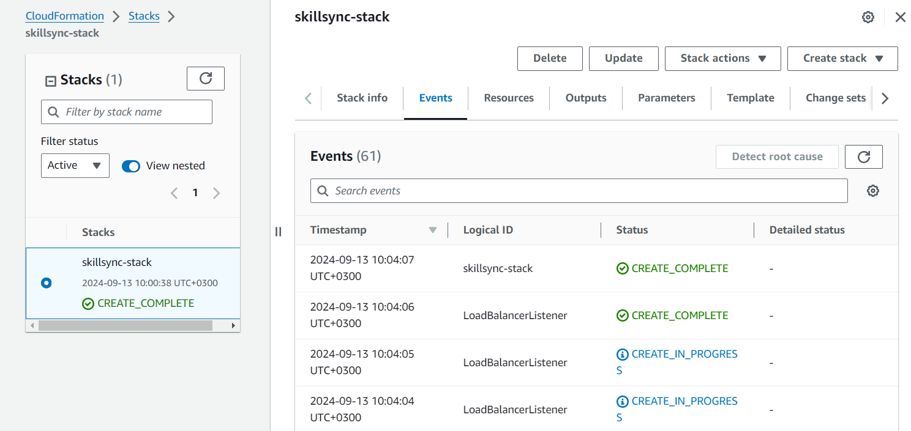

# AWS CLOUDFORMATION
This project contains a CloudFormation template for provisioning AWS resources. It allows for reusablity of the infrastructure in another region or in case of disaster recovery. Below are the details of the resources defined, prerequisites to its creation and deployment instructions.

## Template Overview
The Skillsync.yaml template is in YAML. The following are the resources that have been created.
1. **VPC** and its components:
   - **Internet gateway** attached to the VPC.
   - **Subnets**:
     - 2 **public subnets** in two availability zones
   - **Route tables**:
     - **public route table** associated with the public subnets.
2. **Security group** allowing RDP (port 3389) and HTTP (port 80) access.
3. **Launch Template** : Microsoft Windows Server 2022 Base associated with the security group above.
4. **Load Balancer** - Internet facing
5. **Load Balancer Listener** - listens for HTTP traffic
6. **Target Group**
7. **Auto Scaling Group** leverages the launch template on the target group.
8. **Scale out policy** and **Scale in policy**
9. **Outputs** to be returned:
   - ALB DNS Name
   - AutoScaling Group Name
   - Launch Template Id
   - Target Group ARN
   - S3BucketName
10. **S3 Bucket**

## Prerequisites
- A code editor tool such as VScode.
- An AWS account with the necessary permissions to create resources.
- A Key Pair created in your AWS account (when using SSH access).
- AWS CLI or AWS Management Console to deploy the CloudFormation template.
- (recommended) Install Amazon Q extension to make the coding experience easier.

## Deployment Instructions
1. On AWS Console
- Navigate to the CloudFormation service in the AWS Management Console.
- Choose "Create Stack".
- Select "Choose an Existing Template" and "Upload a Template File" then choose the JSON or YAML formatted file.
- Specify a stack name and any necessary parameters.
- Click "Next" to configure stack options.
- Review the template and click "Create".
- Monitor Stack Creation process. It may take several minutes.
- A successfully created stack is proved by the status "CREATE_COMPLETE".

2. AWS CLI
- Use the following command on AWS CLI to create the CloudFormation stack.
```
aws cloudformation create-stack \
    --stack-name SkillSync-ASG-Stack \
    --template-body file://SkillSync-ASG.yml \
    --capabilities CAPABILITY_IAM CAPABILITY_NAMED_IAM \
    --region <your-region>
```
- Monitor stack creation progress using the command:
```
aws cloudformation describe-stacks \
    --stack-name SkillSync-ASG-Stack
```
- To clean up the resources created using CloudFormation template, use the command below where `Skillsync-Stack` is the name of the stack in this case.
```
aws cloudformation delete-stack \
    --stack-name SkillSync-Stack \
    --region <your-region>
```